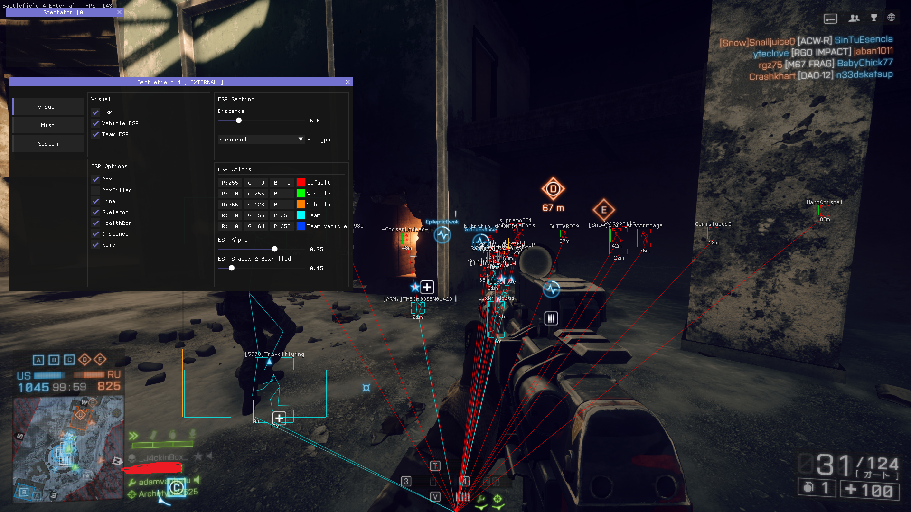
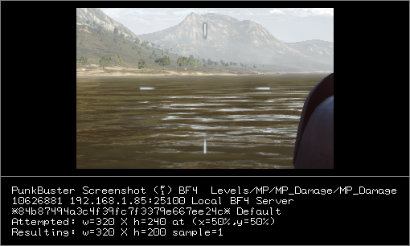

# 概要
Battlefield 4用のシンプルな外部チートです。チート開発に対する興味を失ったので公開しておきます。  
モダンなGUIメニューやビジュアルを兼ね備えた平均的なチートです。研究、分析、学習や調査用にどうぞ。

#### スクリーンショット

## 機能
* ESP
* 観戦者リスト (テストしてない)
* MenuKey : Insert

## PBSS
外部チートはPunkbusterによるスクリーンショットに写らないので心配しなくて大丈夫です。

## 実行
必要なライブラリは全て揃っているので、VisualStudioでビルドすれば普通に動くはずです。  
https://learn.microsoft.com/ja-jp/cpp/build/vscpp-step-0-installation?view=msvc-170

## 使用したライブラリ
* Microsoft DirectXTK->SimpleMath  
https://github.com/microsoft/DirectXTK  
* ImGui  
https://github.com/ocornut/imgui

## 免責事項
このプロジェクトは学習や研究・教育用としてアップロードされました。  
これらの用途以外で使用した場合に発生した如何なる損害についても、製作者(Neko64V)は一切の責任を負いません。  